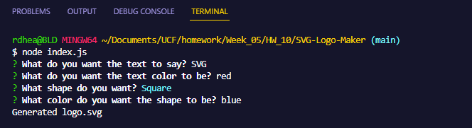

# SVG-Logo-Maker
  

  ## Description
    This project is for generating a SVG logo. It is done by running node index.js in the terminal and one will be prompted with questions to answer that will then write those answers to a logo.svg file. One can also run tests on the project by using npm test.

    This project is great for sharpening JavaScript skills and getting used to using Node.js, inquirer, and jest.

  ## Table of Contents
  * [Installation](#installation)
  * [Usage](#usage)
  * [License](#license)
  * [Display](#display)
  * [Contributors](#contributors)
  * [Tests](#tests)
  * [Questions](#questions)

  ## Installation
  npm i

  ## Usage
  Once npm i is used, type node index.js into the terminal to be prompted with questions to answer to generate a SVG.

  ## License
  For more information on this license, please visit https://mit-license.org/

  ## Display
  

  ## Contributors
  N/A

  ## Tests
  npm test

  ## Questions
  rdheadyii@gmail.com

  https://github.com/rdheadyii

